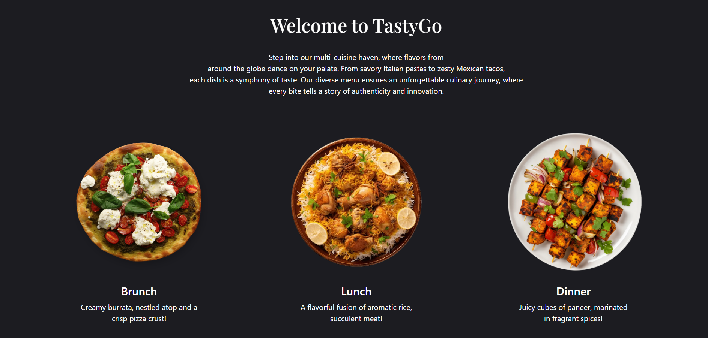
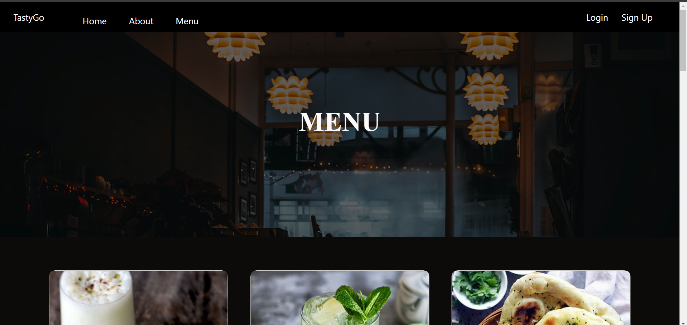
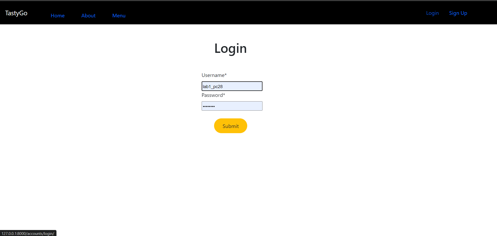
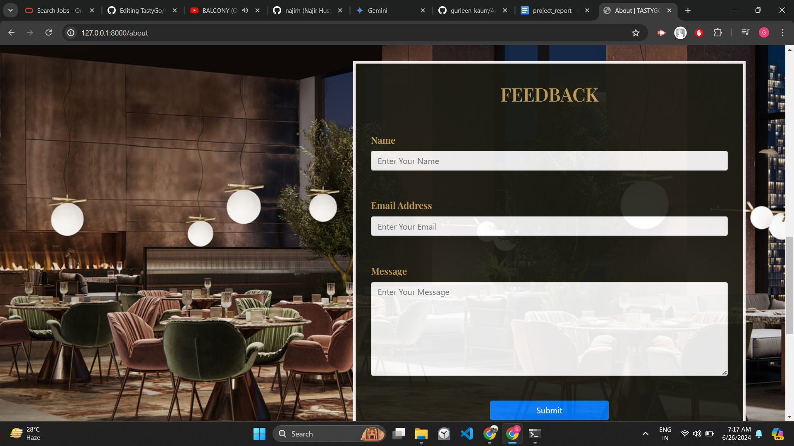
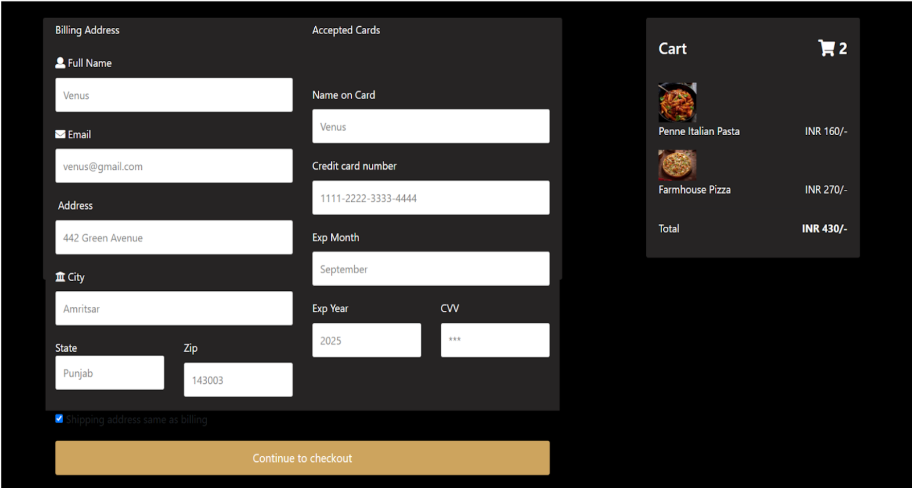
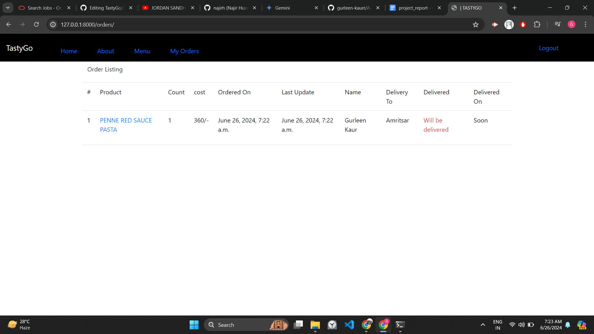

# Online Food Delivery (TastyGo)

A Django-based online food delivery platform that allows users to browse products, view details, potentially create orders, and check order status.
## Features
1.  Menu Page

2.  Login/ Signup

3. Feedback Form

4. Checkout Page

5. Order Details

