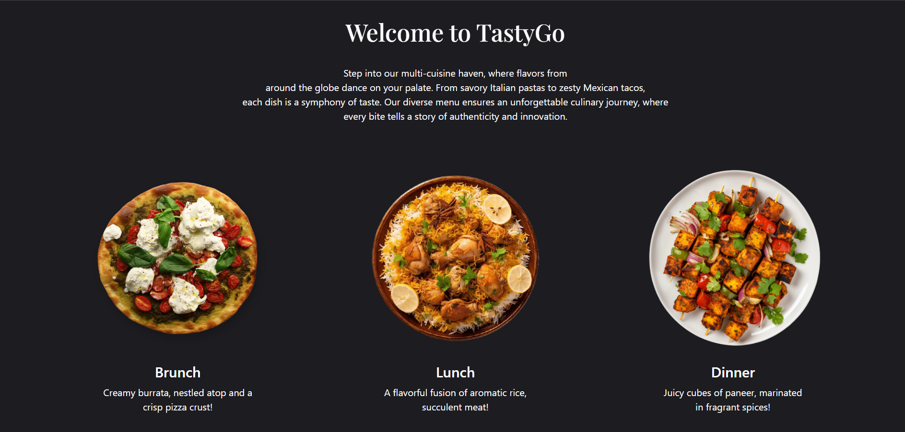
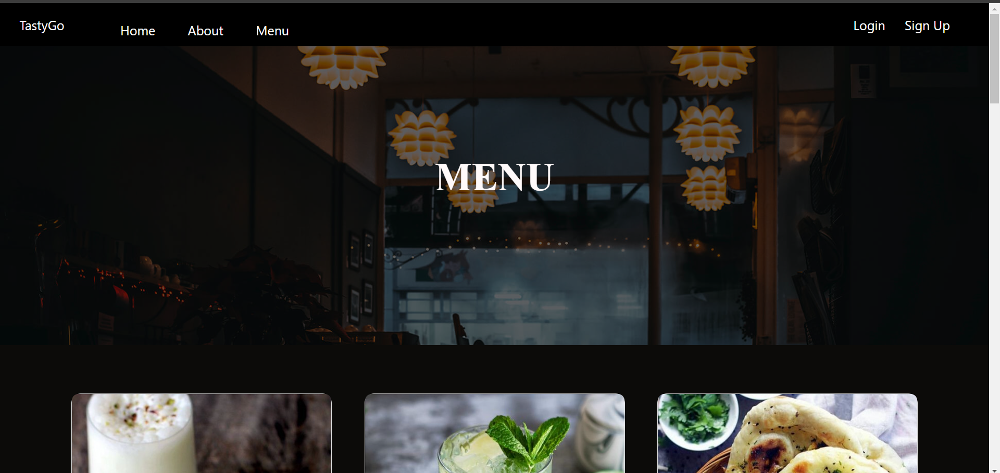
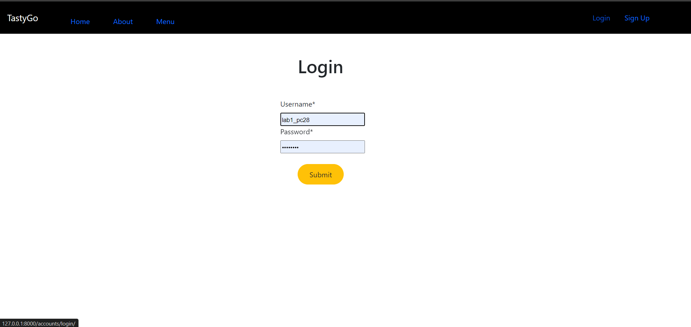
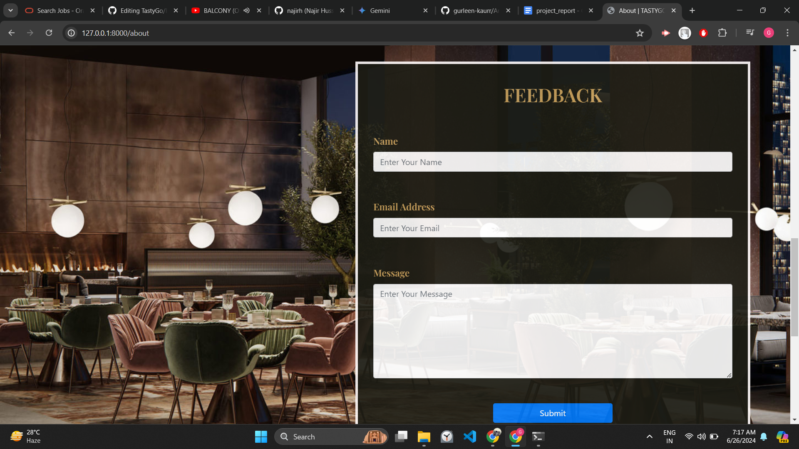
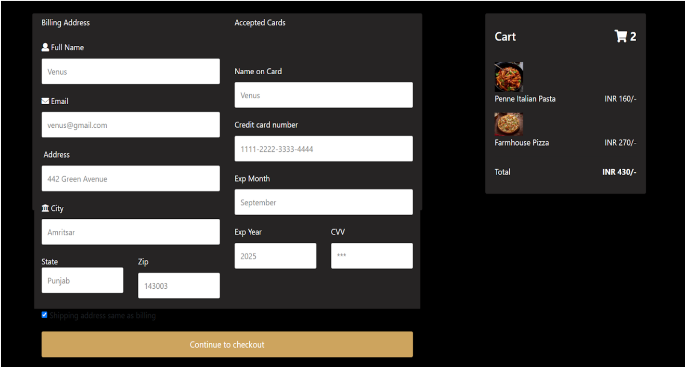
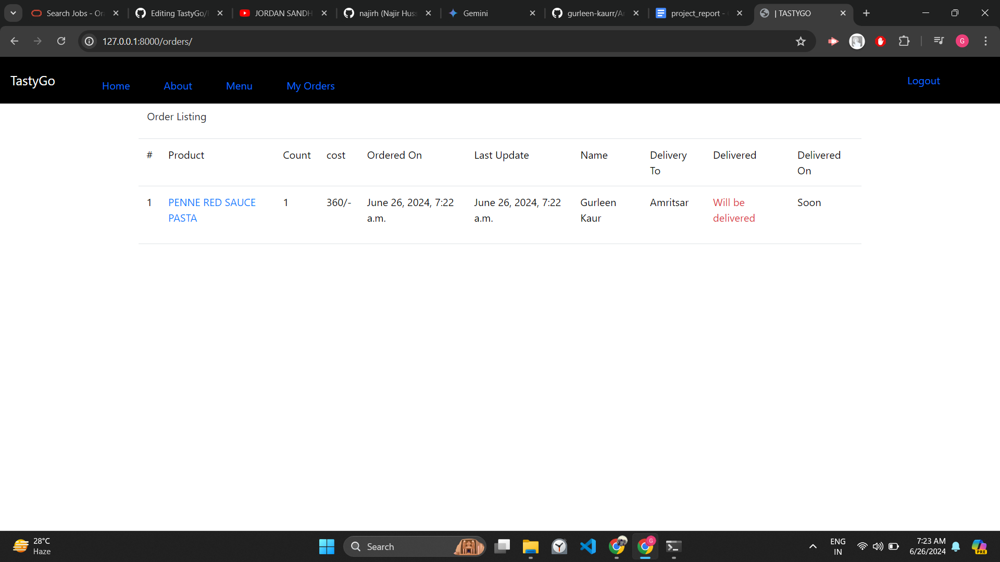

#  TastyGo – Online Food Ordering Website

A Django-based online food delivery platform that allows users to browse products, view details, potentially create orders, and check order status.

TastyGo is an online food ordering web application that allows users to browse food items, add them to a cart, and place orders easily. This project is built to simulate real-world food delivery platforms and to practice web development concepts.

---

## Features

- User-friendly interface  
- Browse food items and categories  
- Add and remove items from cart  
- Order summary and checkout flow  
- Responsive design  
- Login and signup

---

##  Tech Stack

**Frontend:**
- HTML  
- CSS  
- JavaScript  

**Backend:**
- Django

**Database:**
- SQLite  

**Tools:**
- Git & GitHub  
- VS Code  

---

## Screenshots
1.  Menu Page
   

2.  Login/ Signup

4. Feedback Form

5. Checkout Page

6. Order Details

